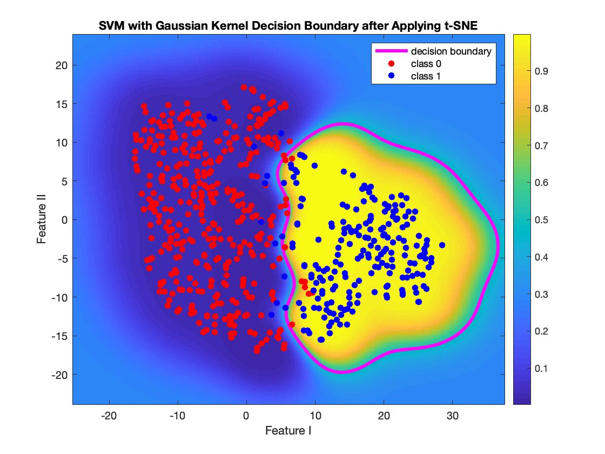
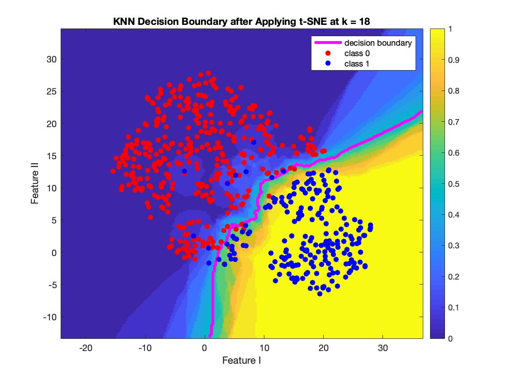
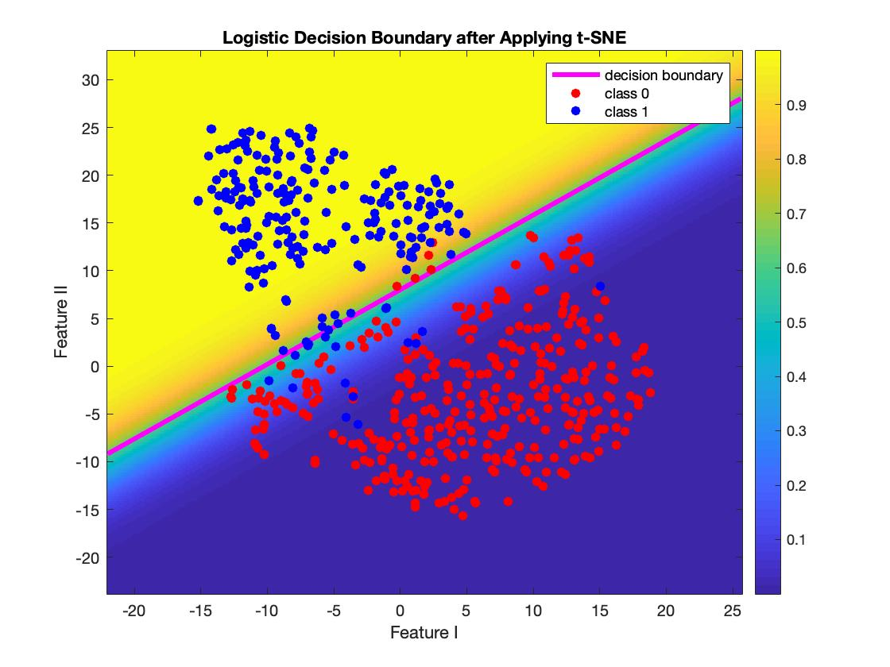
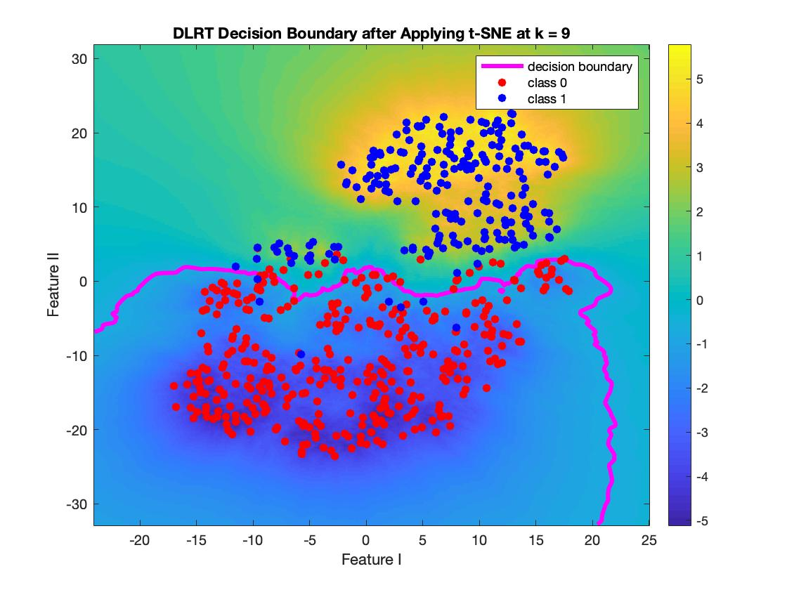
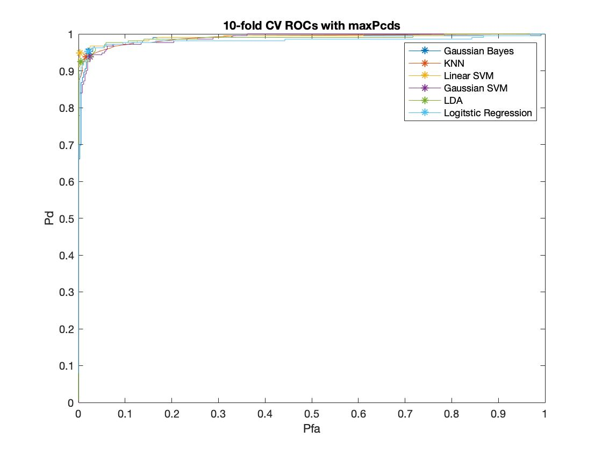

# Breast-Cancer-Classification

The aim of this course project is to explore and compare characteristics of different classifiers (logistic regression, KNN, Gaussian Bayes, SVM, etc.).

Breast Cancer Wisconsin (Diagnostic) Data Set was obtained from UCI machine learning repository https://archive.ics.uci.edu/ml/datasets/Breast+Cancer+Wisconsin+(Diagnostic)

### Examples of decision boundaries of selected classifiers:

### Performance evaluation of classifiers:

References:
1. E.S. McDonald and et al., “Clinical Diagnosis and Management of Breast Cancer,” J Nucl Med, vol. 57, pp. 9S–16S, 2016. DOI: 10.2967/jnumed.115.157834
2. E.R. Myers and et al., “Benefits and Harms of Breast Cancer Screening: A Systematic Review,” Clinical Review & Education, vol. 314, no. 15, pp. 1615-1634, 2015. doi:10.1001/jama.2015.13183
3. K. Kourou and et al., “Machine learning applications in cancer prognosis and prediction,” Computational and Structural Biotechnology Journal, vol. 13, pp. 8–17, 2015.
4. H. Asri and et al., “Using Machine Learning Algorithms for Breast Cancer Risk Prediction and Diagnosis,” Procedia Computer Science, vol. 83, pp. 1064 – 1069, 2016.
5. A.M. Abdel-Zaher and A.M. Eldeib, “Breast cancer classification using deep belief networks,” Expert Systems With Applications, vol. 46, pp. 139–144, 2016.
6. J. Lötsch and et al., “Machine-learning-derived classifier predicts absence of persistent pain after breast cancer surgery with high accuracy,” Breast Cancer Research and Treatment, vol. 171, pp. 399–411, 2018. https://doi.org/10.1007/s10549-018-4841-89
7. Dua, D. and Graff, C. (2019). Breast Cancer Wisconsin (Diagnostic) Data Set, UCI Machine Learning Repository [http://archive.ics.uci.edu/ml]. Irvine, CA: University of California, School of Information and Computer Science.
8. Jolliffe, I. T. Principal Component Analysis. 2nd ed., NY: Springer, 2002.
9. Altman, N. S. “An introduction to kernel and nearest-neighbor nonparametric regression,” The American Statistician, vol. 46 (3), pp. 175–185, 1992. doi:10.1080/00031305.1992.10475879.
10. A. Jain, D. Zongker and et al. “Feature selection: evaluation, application, and small sample performance,” IEEE Transactions on Pattern Analysis and Machine Intelligence, vol. 19(2), pp. 153-158, 1997. DOI: 10.1109/34.574797
11. Hastie, T., R. Tibshirani, and J. Friedman. The Elements of Statistical Learning. 2nd ed., NY: Springer, 2008.
12. Cortes, C., Vapnik, V.N. “Support-vector networks,” Machine Learning, vol. 20 (3), pp. 273–297, 1995. doi:10.1007/BF00994018.
13. McCullagh, P., and J. A. Nelder. Generalized Linear Models. New York: Chapman & Hall, 1990.
14. Mika, Sebastian, et al. “Fisher discriminant analysis with kernels.” Neural networks for signal processing IX: Proceedings of the 1999 IEEE signal processing society workshop (cat. no. 98th8468). IEEE, 1999.
